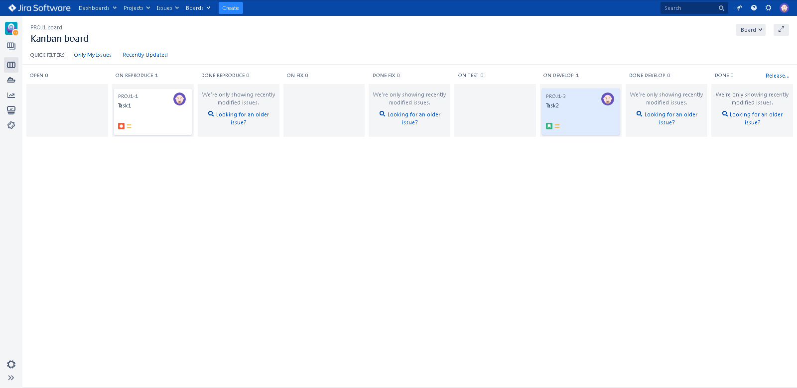

# 09-ci-01-intro

## Основная часть

### 1. Создайте задачу с типом bug, попытайтесь провести его по всему workflow до Done.

### 2. Создайте задачу с типом epic, к ней привяжите несколько задач с типом task, проведите их по всему workflow до Done.

### 3. При проведении обеих задач по статусам используйте kanban.

### 4. Верните задачи в статус Open.

### 5. Перейдите в Scrum, запланируйте новый спринт, состоящий из задач эпика и одного бага, стартуйте спринт, проведите задачи до состояния Closed. Закройте спринт.

### 6. Если всё отработалось в рамках ожидания — выгрузите схемы workflow для импорта в XML. Файлы с workflow и скриншоты workflow приложите к решению задания.

[xml](./xml/Sprint.xml)

